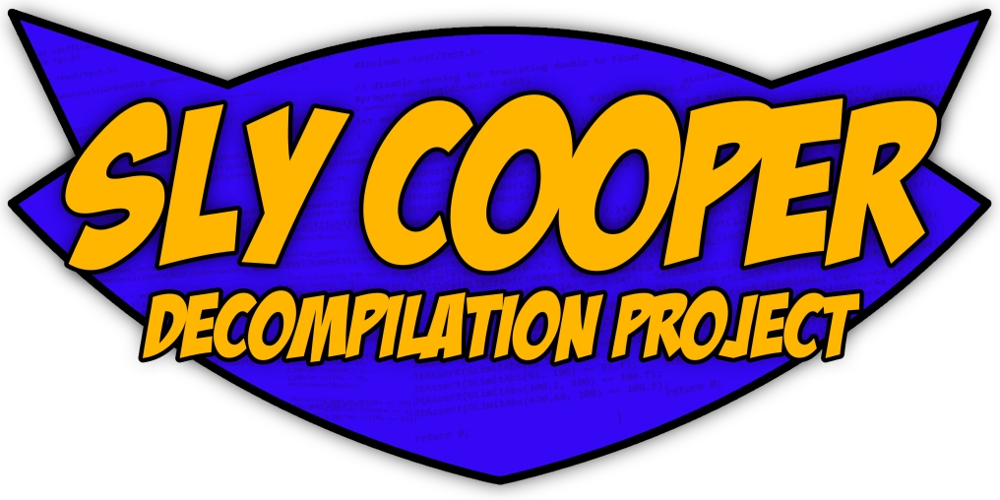

# Sly Cooper and the Thievius Raccoonus

<!-- shields.io badges -->
[![Build status][build-badge]][build-url] <!--[![AppVeyor tests][tests-badge]][tests-url]--> [![Discord Channel][discord-badge]][discord-url] [![Contributors][contributors-badge]][contributors-url] [![Docs][docs-badge]][docs-url] [![Wiki][wiki-badge]][wiki-url]

<!-- Build status badge -->
[build-url]: https://ci.appveyor.com/project/TheOnlyZac/sly1/branch/main
[build-badge]: https://ci.appveyor.com/api/projects/status/800esepa77ctpv5p/branch/main?svg=true

<!-- Test status badge -->
[tests-url]: https://ci.appveyor.com/project/TheOnlyZac/sly1/branch/main/tests
[tests-badge]: https://img.shields.io/appveyor/tests/theonlyzac/sly1/main

<!-- Contributors badge -->
[contributors-url]: https://github.com/theonlyzac/sly1/graphs/contributors
[contributors-badge]: https://img.shields.io/github/contributors/theonlyzac/sly1?color=%23db6d28

<!-- Discord badge -->
[discord-url]: https://discord.gg/2GSXcEzPJA
[discord-badge]: https://img.shields.io/discord/439454661100175380?color=%235865F2&logo=discord&logoColor=%23FFFFFF

<!-- Docs badge -->
[docs-url]: https://theonlyzac.github.io/sly1
[docs-badge]: https://img.shields.io/badge/docs-doxygen-2C4AA8

<!-- Wiki badge -->
[wiki-url]: https://slymods.info
[wiki-badge]: https://img.shields.io/badge/wiki-slymods.info-2C4AA8

[][docs-url]

This is a work-in-progress decompilation of [*Sly Cooper and the Thievius Raccoonus*](https://en.wikipedia.org/wiki/Sly_Cooper_and_the_Thievius_Raccoonus) for the PlayStation 2. It is based on the NTSC-U version of the game (`SCUS-971.98`).

The goal of this project is to better understand how the game works. This repo does not contain any game assets or code from the game's executable.

Documentation of the code can be found at [theonlyzac.github.io/sly1](https://theonlyzac.github.io/sly1). For further reading on the game's internal structures and mechanics, visit the [SlyMods Wiki][wiki-url].

New contributors are welcome and encouraged to make a pull request! If you would like to help but aren't sure where to start, check out [CONTRIBUTING.md](/CONTRIBUTING.MD) and feel free to [join our Discord server][discord-url] for guidance.


## Building

The project can be built on Windows or Linux using `make`. It will build the executable `SCUS_971.98`.

The `tools` directory contains scripts for setting up the build environment on each platform, which involves downloading and installing the required runtime libraries.

### Linux/WSL

**Prerequisites**: `git`, `wine`, `make`, `p7zip-full`

```bash
git clone https://github.com/TheOnlyZac/sly1
cd sly1/tools
./setup-progd-linux.sh
cd ..
make
```

### Windows

**Prerequisites**: `git`, `make`, `7zip`

```powershell
git clone https://github.com/TheOnlyZac/sly1
cd sly1\tools
.\setup-progd-windows.bat
cd ..
make
```

## Running

Running the executable requires a copy of the game and the [PCSX2 emulator](https://pcsx2.net/). Configure the emulator to run the game disc, but boot from the executable.


## Project Structure

The project is split into two main directories: `src` and `test`. The `src` directory contains the decompiled code, and the `test` directory contains unit tests.

* All of the code for the game engine is in `src/P2`. Code for the game's scripting engine, Splice, is in `src/P2/splice`.

* The `test` directory comprises subdirectories for each game system. Each subdirectory contains unit tests for that system.

```
sly1/
├───src/
│   ├───P2/
│   │   ├───splice/
│   │   └───...
└───test/
    ├───clock/
    |   ├───...
    |───difficulty/
    |   ├───...
    └───...
```

## FAQ

#### What is a decompilation?

When the developers created the game, they wrote programming code that we call the source code, and compiled that into an exectuable which can run on the PS2. Our job is to reverse-engineer the compiled code and produce new, original code that behaves the same way. This process leaves us with code that is very similar (but not identical) to the source code and helps us understand what the programmers were thinking when they made the game.

#### How does it work?

We use a tool called [Ghidra](https://ghidra-sre.org/) which was created by the [NSA](https://www.nsa.gov/) for reverse-engineering software. Ghidra analyzes the game binary to identity functions, variables, data types and structures. We then reimplement each individual function by writing C++ code that produces the same output. We do not copy/paste any code or include any original assembly code from the game binary in the decompilation.

#### Has this ever been done before?

This is one of the first major PS2 decompilations. We take inspiration from other decomp projects such as the [Super Mario 64 decomp](https://github.com/n64decomp/sm64) for the N64 and the [Breath of the Wild decomp](https://github.com/zeldaret/botw) for the Wii U (the latter being more similar in scope to this project). There is a Jak & Daxter decomp/PC port called [OpenGOAL](https://github.com/open-goal/jak-project), though that game is written in 98% GOAL language rather than C/C++.

#### Is this a matching decomp?

Most of the decompiled code is not yet matching. We are actively researching the PS2 compiler and working to come up with with a process for function matching. If you would like to help, please join our [Discord server](https://discord.gg/gh5xwfj) and head to `#sly-research`.

#### How can I help?

If you want to contribute but have no idea where to start, check out [CONTRIBUTING.md](/CONTRIBUTING.MD) and feel free to [join our discord server](https://discord.gg/gh5xwfj) if you have any questions!

## Star History

<a href="https://star-history.com/#theonlyzac/sly1&Date">
  <picture>
    <source media="(prefers-color-scheme: dark)" srcset="https://api.star-history.com/svg?repos=theonlyzac/sly1&type=Date&theme=dark" />
    <source media="(prefers-color-scheme: light)" srcset="https://api.star-history.com/svg?repos=theonlyzac/sly1&type=Date" />
    
  </picture>
</a>
